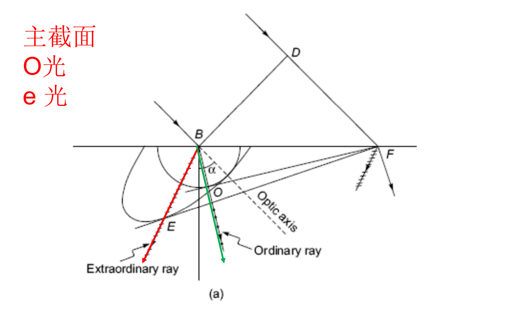

# 06 偏振

## 基础

光波的电场矢量 $\vec{E}$ 只在某个特定的方向或按照特定的规律振动，称为偏振。这是光波是横波的体现（光波振动方向和传播方向垂直）。

**数学描述**：假设光沿 $z$ 轴传播，电场矢量 $\vec{E}$ 分解为 $x$ 和 $y$ 两个方向的分量：

$$
E_x(z,t) = E_{0x} \cos(kz - \omega t)
$$

$$
E_y(z,t) = E_{0y} \cos(kz - \omega t + \varepsilon)
$$

### 分类

1. **自然光**：振动方向随机，是许多方向振动的叠加。
2. **线偏振光**：电场矢量始终在同一直线上振动。
    - 条件：两个分量的相位差 $\varepsilon = k\pi$ 。
3. **圆偏振光**：电场矢量在传播过程中会出现左旋与右旋，最终完整的周期内会形成一个圆。
    - 条件：$E_{0x} = E_{0y}$ **且** 相位差 $\varepsilon = \pm 90^\circ$ ($\pm \pi/2$)。
4. **椭圆偏振光**：和圆偏振类似电场矢量画出一个椭圆。可以看作是线偏振和圆偏振的叠加。
    - 条件：两个分量振幅不相等，或者相位差不是 $0^\circ, 180^\circ, \pm90^\circ$ 的特殊情况。
5. **部分偏振光**：处于偏振光与自然光的叠加状态。

??? note "点击查看详细推导过程"

    === "线偏振推导"
        **线偏振条件**：两个分量的相位差 $\varepsilon = k\pi$ 。  
        将 $\varepsilon = 0$ ($\varepsilon=\pi$ 时同理) 代入方程 (2)：
        
        $$
        E_y = E_{0y} \cos(\Phi)
        $$
        
        此时 $E_x = E_{0x} \cos\Phi$，两式相比：
        
        $$
        \frac{E_y}{E_x} = \frac{E_{0y} \cos\Phi}{E_{0x} \cos\Phi} = \frac{E_{0y}}{E_{0x}}
        $$
        
        整理得：
        
        $$
        E_y = \left( \frac{E_{0y}}{E_{0x}} \right) E_x
        $$
        
        这是一个直线方程 $y = Kx$（斜率为正），说明电场矢量沿经过原点的一、三象限直线振动。

    === "圆/椭圆偏振推导"
        **圆偏振条件**： 必须同时满足 $\delta = \pm \pi/2$ 且 $E_{0x} = E_{0y} = E_0$。
        
        带入 $\delta = -\pi/2$：
        
        $$
        E_x = E_0 \cos\Phi
        $$
        
        $$
        E_y = E_0 \cos(\Phi - \pi/2) = E_0 \sin\Phi
        $$
        
        我们要消去变量 $\Phi$（即消去时间 $t$），利用三角恒等式 $\cos^2\Phi + \sin^2\Phi = 1$。将两个分量分别除以 $E_0$ 并平方，然后相加：
        
        $$
        \left( \frac{E_x}{E_0} \right)^2 + \left( \frac{E_y}{E_0} \right)^2 = \cos^2\Phi + \sin^2\Phi = 1
        $$
        
        整理得标准圆方程：
        
        $$
        E_x^2 + E_y^2 = E_0^2
        $$
        
        这表明电场矢量的末端轨迹是一个半径为 $E_0$ 的圆。椭圆偏振同理，不再赘述。

### 偏振光的获得

1. 选择性吸收 (Selective Absorption)
利用二向色性材料（如偏振片 Polaroid），吸收一个方向的振动，通过垂直方向的振动。

!!! info "马吕斯定律 (Malus's Law)"
    当线偏振光通过检偏器时，透射光强 $I$ 与入射光强 $I_0$ 及夹角 $\theta$ 的关系：
    
    $$
    I = I_0 \cos^2 \theta
    $$

    * 当 $\theta = 0^\circ$ 时光强最大。
    * 当 $\theta = 90^\circ$ 时光强为 0（消光）。
    * **注意**：自然光变为线偏振光时，光强 $I$ 变为入射光的 $\frac{1}{2}$。

2. 反射 (Reflection)
自然光照射到介质表面时，反射光和折射光会发生部分偏振。

!!! info "布儒斯特定律 (Brewster's Law)"
    当入射角 $\theta_p$ 满足特定条件时，反射光变成**完全线偏振光**（且振动方向垂直于光线所在平面）。
    
    $$
    \tan \theta_p = \frac{n_2}{n_1}
    $$
    
    **几何特征**：此时反射光线与折射光线互相垂直 ($\theta_p + \theta_2 = 90^\circ$)。

3. 双折射 (Birefringence)
光通过各向异性晶体（如方解石、石英）时，会分裂成两束光：

* **寻常光 (O光, Ordinary ray)**：遵守折射定律，各方向折射率 $n_O$ 相同。
* **非寻常光 (E光, Extraordinary ray)**：不遵守普通折射定律，折射率 $n_E$ 随方向改变。

这两束光通常是相互垂直的线偏振光。

4. 散射 (Scattering)
光被分子吸收后重新向各个方向辐射。太阳光经过大气分子（瑞利散射）后，在与太阳方向成垂直的方向上，散射光呈线偏振。

## 菲涅尔公式

### 一些定义

- 入射面 (Plane of Incidence)：由入射光线、反射光线和法线所在的平面。
- TE 模（Transverse Electric (横电模)） / s 分量 (德语 senkrecht 垂直)：电场矢量 $\vec{E}$ 垂直于入射面。
- TM 模 Transverse Magnetic (横磁模)/ p 分量 (Parallel)：电场矢量 $\vec{E}$ 平行于入射面。
- $\theta_i$:入射角
- $\theta_i$:折射角

### 电磁场的边界条件

即电场和磁场在切向和法相上的连续性

- $E_{1t} = E_{2t}$ （切向 $\vec{E}$ 连续）$\rightarrow$ 后续用于推导反射/折射系数。
- $H_{1t} = H_{2t}$ （切向 $\vec{H}$ 连续）$\rightarrow$ 后续用于推导反射/折射系数。
- $B_{1n} = B_{2n}$ （法向 $\vec{B}$ 连续）。
- $D_{1n} = D_{2n}$ （法向 $\vec{D}$ 连续）。

理解起来比较简单，在趋于无穷小的平面内磁感应强度，磁通量，电流，静电荷趋于0，
- [ ]补充一下推导

### **公式**

!!! info "菲涅尔公式 (Fresnel Equations)"
    1. s 分量：
          - 反射系数：$r_{\perp} = \frac{n_1 \cos \theta_i - n_2 \cos \theta_t}{n_1 \cos \theta_i + n_2 \cos \theta_t} = -\frac{\sin(\theta_i - \theta_t)}{\sin(\theta_i + \theta_t)}$
          - 透射系数：$t_{\perp} = \frac{2 n_1 \cos \theta_i}{n_1 \cos \theta_i + n_2 \cos \theta_t}$

    2. p 分量：
          - 反射系数：$r_{\parallel} = \frac{n_2 \cos \theta_i - n_1 \cos \theta_t}{n_2 \cos \theta_i + n_1 \cos \theta_t} = \frac{\tan(\theta_i - \theta_t)}{\tan(\theta_i + \theta_t)}$
          - 透射系数：$t_{\parallel} = \frac{2 n_1 \cos \theta_i}{n_2 \cos \theta_i + n_1 \cos \theta_t}$

- 当 $\theta_i + \theta_t = 90^\circ$ 时，$\tan(\theta_i + \theta_t) \rightarrow \infty$，导致 $p$ 分量的反射系数 $r_{\parallel} \rightarrow 0$。这就是布鲁斯特角的数学来源——p 分量完全不反射，直接穿透。
- $s$ 分量的反射通常比 $p$ 分量强。
- 

### 能量分配

1. 反射率：$R = r^2$，对于两个分量$R_{\perp} = r_{\perp}^2$, $R_{\parallel} = r_{\parallel}^2$
2. 透射率：公式：$T = \frac{n_2 \cos \theta_t}{n_1 \cos \theta_i} t^2$  
**$T \neq t^2$ (！)**

!!! abstract "原因"
    原因：光进入不同介质后，速度变了（$n$ 不同），且光束的截面积因为折射角度也变了（$\cos$ 项）。

3. 能量守恒：$R + T = 1$

## 双折射

一些具有各向异性的晶体会发生双折射现象，一束光变为两束偏振光o光和e光

### 一些概念

- 寻常光 (Ordinary ray, o光)：遵守普通的折射定律。在晶体中各个方向传播速度相同 ($v_o = c/n_o$)。其波面是球面。
- 非寻常光 (Extraordinary ray, e光)：不遵守普通的折射定律。传播速度随方向改变 ($v_e$ 是方向的函数)。其波面是旋转椭球面。
- 光轴：当入射光的方向沿着光轴时o光e光传播速度，折射率相同
- 主平面：所有光轴集合的平面o光的振动方向 **垂直** 于主平面。e光的振动方向 **平行** 于主平面。

$n_e(\theta)$公式： 
$$\frac{1}{n_e^2(\theta)} = \frac{\cos^2\theta}{n_o^2} + \frac{\sin^2\theta}{n_e^2}$$  
其中$n_e$为垂直主平面的折射率，$n_\theta$为平行主轴的折射率，$\theta$光波法线与光轴的夹角

一些推论：  
- 离散角公式：$$\tan \alpha = \frac{(n_e^2 - n_o^2) \tan \theta}{n_o^2 + n_e^2 \tan^2 \theta}$$  
- 由波法线的直接推论：$\cot \theta=(\frac{n_o}{n_e})^2\cot \varepsilon,\alpha=|\theta-\varepsilon|$
### 惠更斯作图法

确定o光和e光的折射光线：先确定椭圆波形和圆波形的关系：
- $n_e < n_o$：负晶体，$v_e > v_o$，椭球包着球     
- $n_e > n_o$：反之  

---

## 晶体光学器件

这部分回答了“知道了双折射原理后，我们能造出什么工具？”的问题。

### 1. 晶体偏振棱镜 (Polarizers)
利用晶体的双折射性质，将 $o$ 光和 $e$ 光在空间上分开，从而获得单一的线偏振光。

* **原理**：通常利用 **全反射** 原理。让折射率较大的那束光（通常是 $o$ 光，在方解石中 $n_o > n_e$）在胶合层或空气隙面上发生全反射被吸收或导出，只让 $e$ 光通过。

=== "尼科耳棱镜 (Nicol)"
    * 最早的偏振棱镜，用加拿大树胶胶合。
    * **缺点**：出射光平移且光束会旋转，目前已较少使用。

=== "格兰-汤普森棱镜 (Glan-Thompson)"
    * **特点**：标准的高精度偏振器。两块方解石胶合，光轴平行于表面。
    * **优点**：接受角大。
    * **缺点**：胶合层限制了抗激光损伤能力（强光下胶水会化）。

=== "格兰-傅科棱镜 (Glan-Foucault)"
    * **特点**：将胶合层换成 **空气隙**。
    * **优点**：抗损伤阈值高（适合强激光）。
    * **缺点**：视场角很小，透过率稍低（因为界面反射）。

### 2. 偏振分束棱镜 (Beam Splitters)
目的不是消除一束光，而是让 $o$ 光和 $e$ 光分开，同时利用。

* **沃拉斯顿棱镜 (Wollaston Prism)**：
    * 结构：两块直角棱镜光轴 **互相垂直** 胶合。
    * 结果：$o$ 光和 $e$ 光向两侧分开，对称偏折。
* **洛匈棱镜 (Rochon Prism)**：
    * 结构：第一块光轴 **平行** 于传播方向，第二块 **垂直**。
    * 结果：一束光直通（通常是 $o$ 光），另一束光偏折（$e$ 光）。

### 3. 波片 (Wave Plates)
作用：产生特定的相位差 $\delta$，改变偏振态。

* **1/4 波片 ($\delta = \pi/2$)**：线偏振 $\leftrightarrow$ 圆/椭圆偏振。
* **1/2 波片 ($\delta = \pi$)**：旋转线偏振光的振动方向。

---

## 偏振光的产生与检验

这部分是考试中的 **高频逻辑题**：给你一束光，如何判断它是什么偏振态？

### 1. 产生圆/椭圆偏振光
* **方法**：线偏振光 + 1/4 波片。
* **关键条件**：
    * **圆偏振**：线偏振光振动方向与波片光轴夹角 $\theta = 45^\circ$。
    * **椭圆偏振**：$\theta \neq 0^\circ, 45^\circ, 90^\circ$ 的任意角度。

### 2. 偏振光的检验流程 (重点)

??? tip "检验逻辑流程图"
    如何区分 **自然光、线偏振、圆偏振、椭圆偏振、部分偏振**？
    需要用到 **检偏器 (P)** 和 **1/4 波片 (C)**。

    1.  **第一步：旋转检偏器**
        * **光强无变化** $\rightarrow$ 可能是 **自然光** 或 **圆偏振光**。
            * *进一步区分*：加 1/4 波片，再旋转检偏器。
                * 有消光（变黑） $\rightarrow$ **圆偏振光**。
                * 无变化 $\rightarrow$ **自然光**。
        * **光强有变化（有消光）** $\rightarrow$ **线偏振光**。
        * **光强有变化（无消光）** $\rightarrow$ 可能是 **椭圆偏振光** 或 **部分偏振光**。
            * *进一步区分*：加 1/4 波片（快轴平行于光强最大方向），再旋转检偏器。
                * 有消光 $\rightarrow$ **椭圆偏振光**。
                * 无消光 $\rightarrow$ **部分偏振光**。

---

## 旋光现象 (Optical Activity)

这部分介绍了一种特殊的偏振现象——偏振面的旋转。

### 1. 自然旋光 (Natural Optical Activity)
* **现象**：线偏振光通过某些物质（如石英、糖溶液）后，振动面旋转了角度 $\psi$。
* **规律**：
    * $\psi = \alpha l$ （固体）
    * $\psi = [\alpha] c l$ （溶液，用于测糖浓度）
* **原理**：菲涅尔解释。线偏振光分解为左旋和右旋圆偏振光，它们在介质中速度不同 ($n_L \neq n_R$)，导致相位差，合成后振动面旋转。

### 2. 磁致旋光——法拉第效应 (Faraday Effect)

!!! info "法拉第效应公式"
    **现象**：在介质中加磁场 $B$，光沿磁场方向传播时，偏振面发生旋转。
    
    $$
    \theta = V B L
    $$
    
    * $V$：维尔德常数 (Verdet constant)。
    * $B$：磁感应强度。
    * $L$：介质长度。

### 3. 核心考点：非互易性 (Non-reciprocity)

这是法拉第效应与自然旋光最大的区别。

* **自然旋光**：光往返一次，旋转角度互相 **抵消**（回到原点）。
* **法拉第旋光**：光往返一次，旋转角度互相 **叠加**（越转越大）。
    * *比喻*：自然旋光像“弹簧门”，怎么推开就怎么弹回来；法拉第效应像“拧螺丝”，每转一圈就更深一步。

### 4. 应用：光隔离器 (Optical Isolator)
利用法拉第效应的非互易性，制作 **“光二极管”**，只允许光单向通过，保护激光器不被反射光损坏。

* **结构**：起偏器 ($0^\circ$) + 法拉第旋转器 ($45^\circ$) + 检偏器 ($45^\circ$)。
* **原理**：
    * **正向**：光旋转 $45^\circ$ 通过。
    * **反向**：反射回来的光再旋转 $45^\circ$（变成 $90^\circ$），被起偏器 ($0^\circ$) 完全阻挡。

---

## 典型例题与考点

### 例题1：马吕斯定律计算

**题目**：自然光通过起偏器后强度 $I_0$，再通过检偏器（透振方向夹角 $\theta=30°$），求出射光强。

??? note "答案要点"
    自然光经起偏器后变为线偏振光，强度减半 $I_1=I_0/2$。经检偏器由**马吕斯定律**：

    $$
    I_2=I_1\cos^2\theta=\frac{I_0}{2}\cos^2 30°=\frac{I_0}{2}\cdot\frac{3}{4}=\frac{3I_0}{8}
    $$

    **考点**：自然光过偏振片必减半；马吕斯定律 $I=I_0\cos^2\theta$ 是偏振光干涉的基础。

### 例题2：波片与偏振态转换

**题目**：线偏振光（振动方向与波片光轴夹角 $45°$）经 $\lambda/4$ 波片后变成什么偏振态？经 $\lambda/2$ 波片呢？

??? note "答案要点"
    线偏振光分解为光轴方向 $o$ 光与垂直方向 $e$ 光，振幅相等（$45°$）。波片引入相位差 $\Delta\varphi$：

    - **$\lambda/4$ 波片**（$\Delta\varphi=\pi/2$）：两分量相位差 $\pi/2$，合成**圆偏振光**（$45°$ 入射 + $\lambda/4$ → 圆偏振，这是产生圆偏振光的标准方法）。
    - **$\lambda/2$ 波片**（$\Delta\varphi=\pi$）：两分量反相，合成仍为**线偏振光**，但振动方向相对光轴对称翻转（即转过 $2\times45°=90°$）。

    **考点**：$\lambda/4$ 波片用于线偏振↔圆/椭圆偏振转换；$\lambda/2$ 波片用于改变线偏振方向。夹角 $45°$ 是产生圆偏振的必要条件。

### 例题3：自然旋光与法拉第旋光的往返

**题目**：线偏振光通过自然旋光介质旋转 $\theta$ 角后，用镜面反射回来再次通过介质，总旋转角是多少？若是法拉第旋光呢？

??? note "答案要点"
    - **自然旋光**：反射后光路反向，左旋变右旋（介质对反向传播光的旋光方向反转），故往返总旋转 $\theta-\theta=0$（**抵消**，回到原振动面）。
    - **法拉第旋光**：磁场方向不变，反射后旋光方向**不变**（非互易性），往返总旋转 $\theta+\theta=2\theta$（**叠加**）。

    这是光隔离器的基础——法拉第效应的非互易性使反向光被阻挡。

### 考点速记

| 概念 | 关键点 |
|:---|:---|
| 马吕斯定律 | $I=I_0\cos^2\theta$（线偏振过检偏器） |
| 自然光过偏振片 | 强度减半 |
| $\lambda/4$ 波片 | 线偏振($45°$)→圆偏振；相位差 $\pi/2$ |
| $\lambda/2$ 波片 | 线偏振方向翻转 $2\theta$；相位差 $\pi$ |
| 自然旋光 | 往返抵消（互易） |
| 法拉第旋光 | 往返叠加（非互易），$\theta=VBL$ |
| 光隔离器 | 起偏器$0°$+法拉第$45°$+检偏器$45°$，反向被挡 |